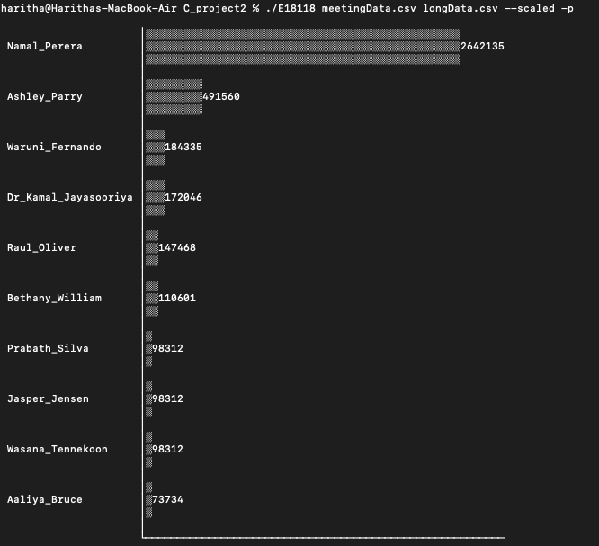

# Meeting-Data-Visualizer-cli

## Description
Due to the social distancing and travel restrictions all around the world, people have moved most of the work to virtual environments. Due to this, the usage of meeting tools has exponentially increased so as the data gathered through such tools. The objective of this project is to analyze such data files and visually represent the data as per the requirement of user.

## Outcome
I have developed expertise in operating within a Linux environment, showcasing adeptness in employing ANSI characters for creating fundamental figures and characters. Additionally, I have demonstrated efficiency in managing command line arguments and employing debugging methodologies.

Furthermore, I have acquired knowledge and skills in optimizing programs through the utilization of linked list data structures and dynamic memory allocation in the C programming language. This includes leveraging the advantages of linked lists to enhance program performance and efficiency. Additionally, I have gained proficiency in gracefully handling errors, ensuring robust and error-free execution of the programs.  

## Usage 
* Assuming program name is prog
* use std=c99 flag to compile the source code
1. ./prog file1
     + The program must take at least one file name to work. All other arguments are optional. If not given, the program will work as non-scaled, will output counts for meeting and limit the output rows to 10.
2. ./prog − m −l 8 file1 file2 file3 ...
    + Display top 8 hosts accoring the number of meetings considering all files.
3. ./prog − m −−scaled −l 10 file1 file2 file3 ...
    + Display top 10 hosts accoring the number of meetings considering all files. Also the first row of the graph should fully occupy the max print width.

## Output

